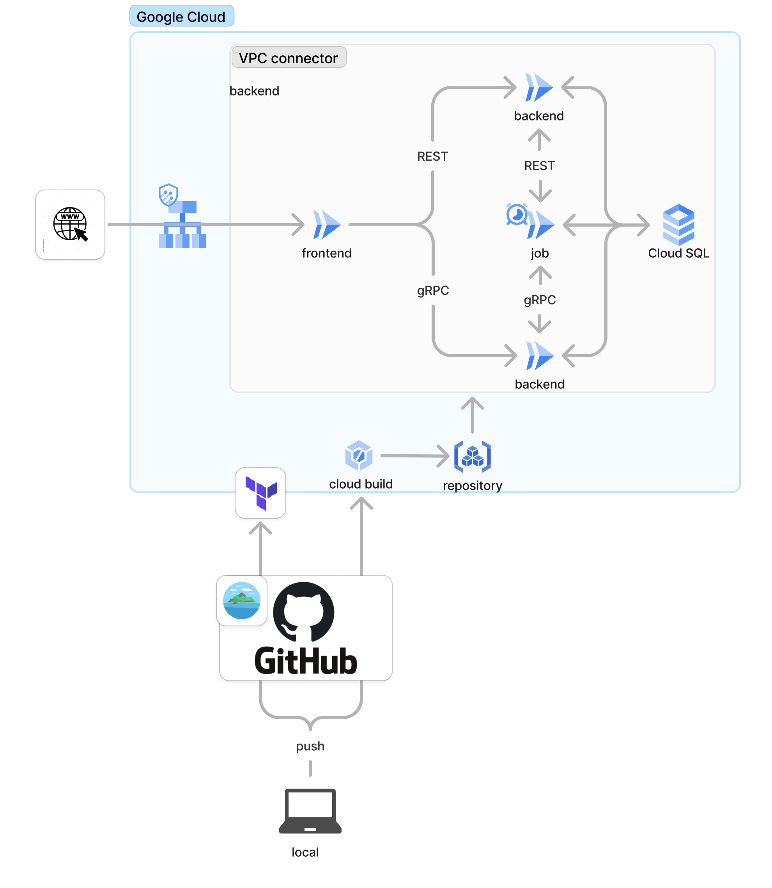

# Fullstack Template

## コンセプト
- Next.jsとgolang/ginを使ったフルスタック開発のテンプレート
- RESTとgRPCのAPI両方を作成
- terraformでGoogle Cloudに環境構築

---
## 構成


---
## REST API
### Frontend: Next.js
- ただbackendにgetリクエストするだけ
### Backend: golang/gin/sqlc
- Framework: Gin
- SQL Builder: sqlc
- ローカルでは`air`でホットリロード。
### job: golang
- ただbackendにgetリクエストするだけ

---
## gRPC
unaryとserver streamingの2つを実装<br>
### Frontend: Next.js
- [Connect](./apps/grpc_frontend/README.md) でリクエスト
### Backend: golang/sqlc
- connectのバックエンドを実装
- それ以外はREST APIと同じ
### protoフォルダの管理方法
- root直下に配置して各app内にシンボリックリンクを張る
- それぞれのappの言語で.pb生成コマンドを使用するのと、上位ディレクトリを参照するのが良くなさそうで。
- .pbはローカルで生成してgit管理する

---
### Infra: Terraform
- Google Cloud Platform
- Atlantis[Demo](./infra/terraform/atlantis/README.md)

### Database: PostgreSQL, sqlite
- お金をかけたくない時期はsqliteを使用

## ディレクトリ
```
├── apps
│ ├── backend        # golang/gin
│ ├── frontend       # nextjs/Page router
│ ├── grpc_backend   # golang/gRPC(connect)
│ ├── grpc_frontend  # nextjs/Page router/gRPC(connect)
│ └── job            # golang/REST/gRPC
├── infra
│ ├── atlantis       # atlantis resources
│ ├── terraform      
│ │ ├── development
```

# App demo


https://github.com/user-attachments/assets/825f0740-9856-47fb-b1dc-7c3b646b2988

